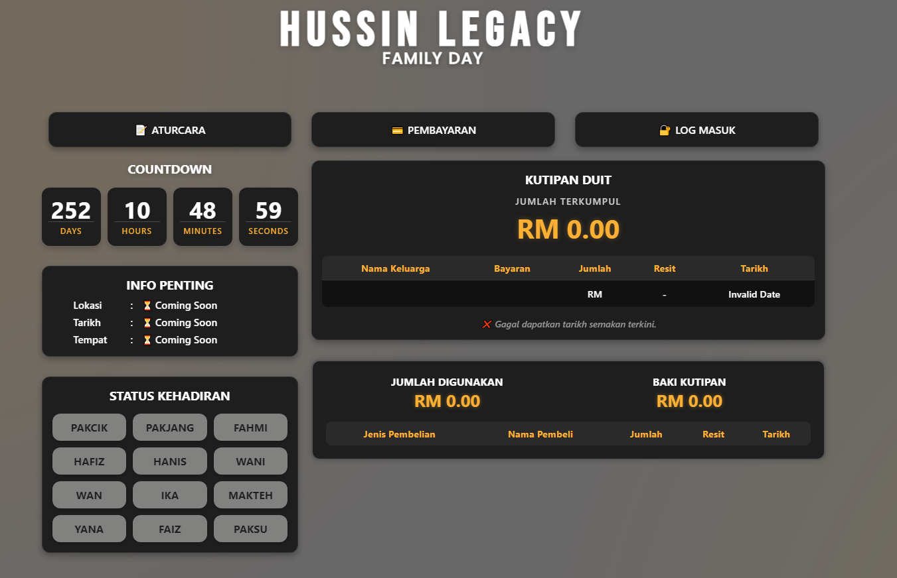
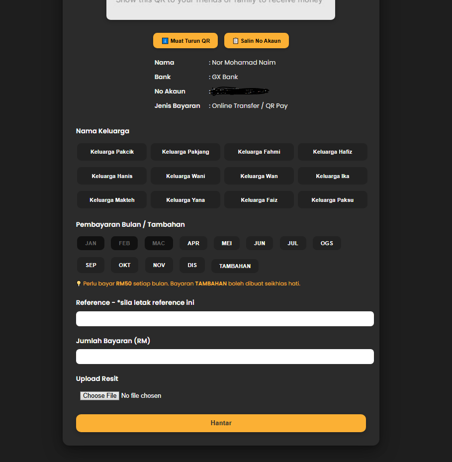
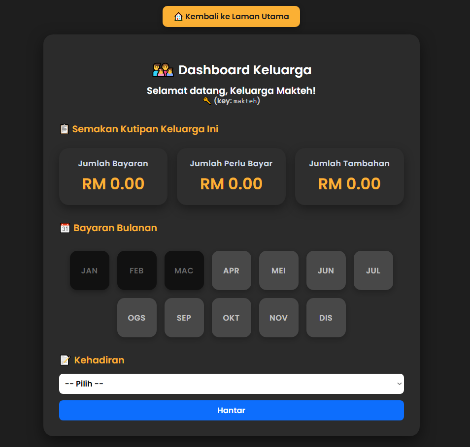

# 🏡 Family Day - Hussin Legacy 2025

https://kepasakan.github.io/hussin-legacy-family-day/index.html

This is a dynamic website built for the **Hussin Legacy Family Day 2025** event. It includes:

- Real-time dashboard to monitor kutipan & kehadiran
- Family login system
- Telegram-integrated payment form with resit upload
- Countdown timer
- Modern dark UI
- Aturcara (event itinerary) section

## ✨ Features

- 🔐 Family login by unique key
- 📊 Kutipan & dashboard view per family
- 🧾 Resit upload integrated with Telegram bot
- 📅 Kehadiran submission form
- 📸 QR bank details + copy number/download options
- 🖥️ Fully responsive layout for mobile/desktop
- 🧩 Powered by Google Sheets + Apps Script backend

## 📸 Screenshots

### 🏠 Main Dashboard


### 🧾 Payment Page


### 🧑‍💼 Akaun Family View


## 📁 Project Structure

```plaintext
HUSSIN-LEGACY-FAMILY-DAY/
├── asset/
│   └── qr_code.jpg
│
├── css/
│   ├── akaun.css
│   ├── aturcara.css
│   ├── bayaran.css
│   └── login.css
│
├── js/
│   ├── akaun.js
│   ├── aturcara.js
│   ├── bayaran.js
│   ├── kehadiran-status.js
│   ├── kutipan.js
│   ├── login.js
│   └── script.js
│
├── pages/
│   ├── akaun.html
│   ├── aturcara.html
│   ├── bayaran.html
│   ├── bayaran_berjaya.html
│   ├── bayaran_gagal.html
│   └── login.html
│
├── index.html
├── index.css
├── index.js
└── README.md
```


## 🔧 Integrations

- **Google Sheets** – backend data storage
- **Google Apps Script** – API layer (GET support)
- **Telegram Bot API** – automatic resit image forwarding
- **GitHub Pages** – static site hosting

## 👨‍💻 Developer

Built by: **Nor Mohamad Naim (aka treasurer 🧾)**  
Contact: ayiemfassal@gmail.com  
Timeline: April 2025 – completed after 15+ rounds of real-user testing & debugging 

## 🙏 Acknowledgement

Big thanks to **Hussin Legacy family members** for supporting and testing the system.  
This project was done **100% manually by code and heart ❤️** 

## 📄 License

Personal/internal use only. Not to be redistributed or monetized without permission.  
© 2025 Nor Mohamad Naim. All rights reserved.
